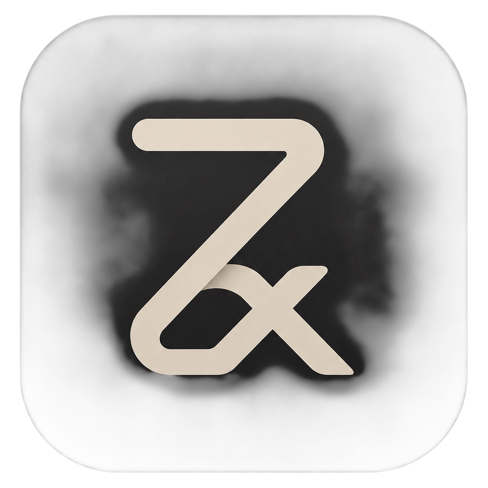
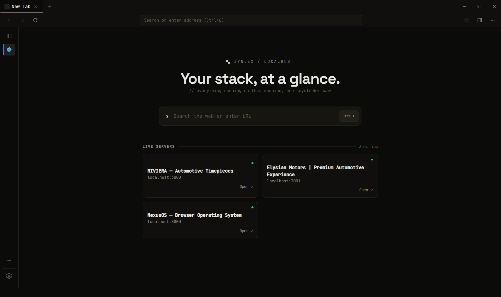
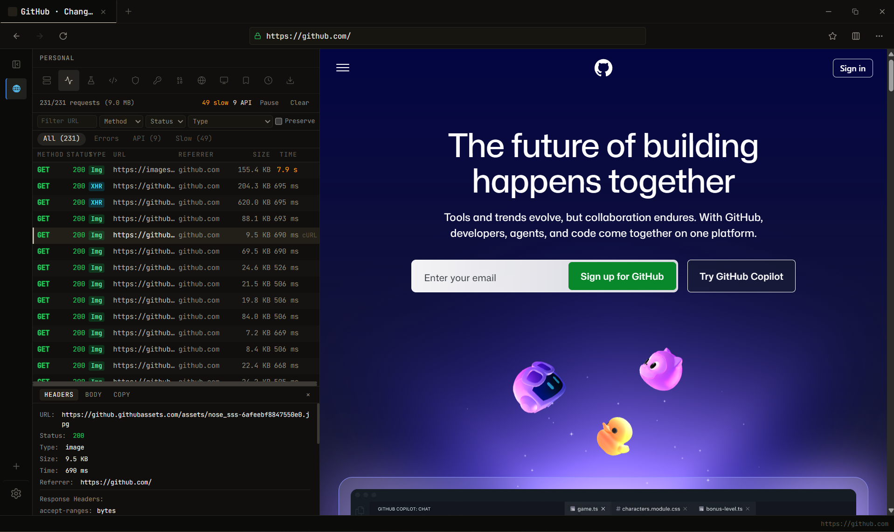
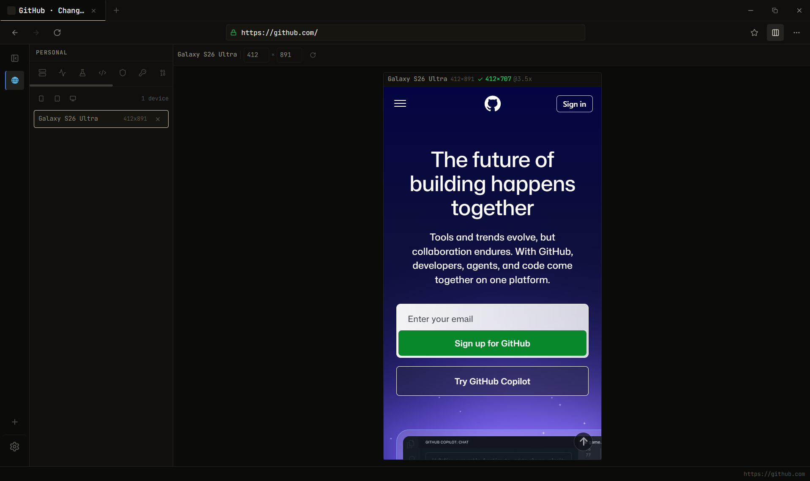
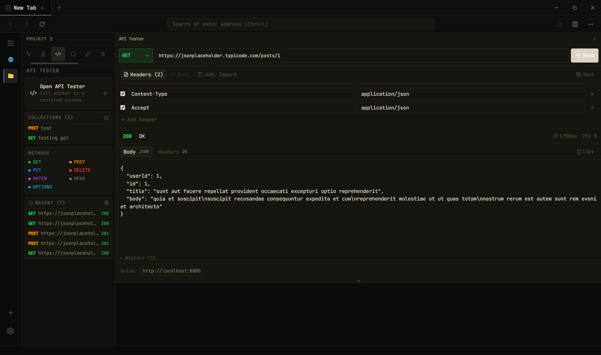

<div align="center">



# ZYNLEX

**A browser for web developers, with the devtools built into the chrome instead of bolted on. Windows only.**

[](LICENSE)
[](https://github.com/webtools-dotcom/Zynlex/actions/workflows/ci.yml)
[](https://github.com/webtools-dotcom/Zynlex/releases/latest)
[](https://github.com/webtools-dotcom/Zynlex/releases/latest)


### [Download for Windows →](https://github.com/webtools-dotcom/Zynlex/releases/latest)

</div>

---

## What you get

- **Your dev servers, found for you.** ZYNLEX scans localhost and lists what's running. New tab, click the port, you're on it.
- **A network log that isn't a panel you forgot to open.** Requests, timing, response bodies, filters, pause/resume — scoped per tab, always one keystroke away.
- **Device viewports at true 1:1.** Pick a phone, get a real frame with the right pixel ratio, user agent, Client Hints and touch flags. Not a scaled-down screenshot.
- **Header injection per tab.** Add, override or strip request headers with glob-matched rules. Test an auth flow without touching a proxy.
- **An API client in the sidebar.** Methods, headers, bodies, cURL import, saved collections. It runs through Rust, so app CORS and CSP don't get a vote.
- **Workspaces.** Each project gets its own tabs, bookmarks, header rules and saved requests. Switching contexts doesn't mean 40 tabs.
- **The small stuff, in-window.** Meta and Open Graph validation, social preview cards, a cookie inspector that sees HttpOnly, UA switching, JWT decode, Base64.
- **No account, no telemetry, no network calls of its own.**

Everything reachable from `Ctrl+K`.

## Why this exists

Chrome DevTools is excellent and lives in the wrong place — it's a drawer you open inside a browser that doesn't know or care what you're building. Responsively and Polypane put device frames first and stop short of being browsers you'd actually browse in. Meanwhile the things you reach for twenty times a day (which port is that, what did that request return, what does this look like on a phone, add this header) live in four separate applications.

ZYNLEX is the other arrangement: a real browser where those tools are the chrome. Every tab is a native WebView2 child window, so the page you're testing renders in the same engine that ships with Edge — no Electron wrapper, no shim. The installer is 4.8 MB because the rendering engine is already on your machine.

| | ZYNLEX | Responsively | Polypane | Chrome DevTools |
|---|---|---|---|---|
| Price | Free, Apache-2.0 | Free, MIT | Paid | Free |
| macOS / Linux | **No** | Yes | Yes | Yes |
| Multiple devices side by side | No — one at a time | **Yes** | **Yes** | Limited |
| Accessibility auditing | No | No | **Yes** | Yes |
| Usable as your everyday browser | Yes | No | Partly | n/a |
| Network log, header rules, API client built in | Yes | No | Partly | Log only |
| Localhost server discovery | Yes | No | No | No |

If you need macOS, several devices at once, or accessibility audits, one of the others is the better tool and I'd rather you use it.

## Install

Grab the installer from the [latest release](https://github.com/webtools-dotcom/Zynlex/releases/latest) and run it.

**Requirements:** Windows 10 or 11, and the WebView2 runtime — already present on Windows 11 and on most Windows 10 machines. The installer adds it if it's missing.

Building from source:

```bash
pnpm install
pnpm tauri dev
```

## A look around

**Home — your servers, live.**



**Network log.** Per-tab capture through native WebView2 COM, not a proxy. Filter by method, status, resource type; search URLs; pause the stream; keep the log across reloads.



**Viewport.** One device, rendered at its real CSS pixel size.



**API tester.** Saved per workspace, with folders and history.



## Limitations

Stated plainly so you can decide before downloading:

- **Windows only, and not by oversight.** Tabs, cookies, network capture, header injection and viewport emulation are all built directly on WebView2 COM APIs. There's no WebKitGTK or WKWebView equivalent written yet, so a build for another platform compiles but deliberately refuses to start rather than launch a browser with none of its tools. macOS and Linux are planned — see [ROADMAP.md](ROADMAP.md).
- **Downloads show started and finished, not a percentage.** Tauri's download event carries no progress callback.
- **Header rules don't cover WebSockets.** WebView2 never fires its request event for the handshake, so this isn't fixable from the app side.
- **The network log captures fetch and XHR, not images, fonts or stylesheets.** That's deliberate — asset noise is what makes a request list unusable.

## Docs

- [docs/architecture.md](docs/architecture.md) — process model, bounds and resize, fullscreen, viewport emulation, security boundary.
- [docs/design-system.md](docs/design-system.md) — tokens, typography, layout rules.
- [CONTRIBUTING.md](CONTRIBUTING.md) — build commands and pre-PR checks.
- [ROADMAP.md](ROADMAP.md) — what's open.

## Contributing

Issues and pull requests are welcome. [CONTRIBUTING.md](CONTRIBUTING.md) has the build commands and the checks that run before review. If you're picking up something non-trivial, open an issue first so we don't both write it.

Built with [Tauri](https://tauri.app), React and Rust.

## License

[Apache-2.0](LICENSE).
