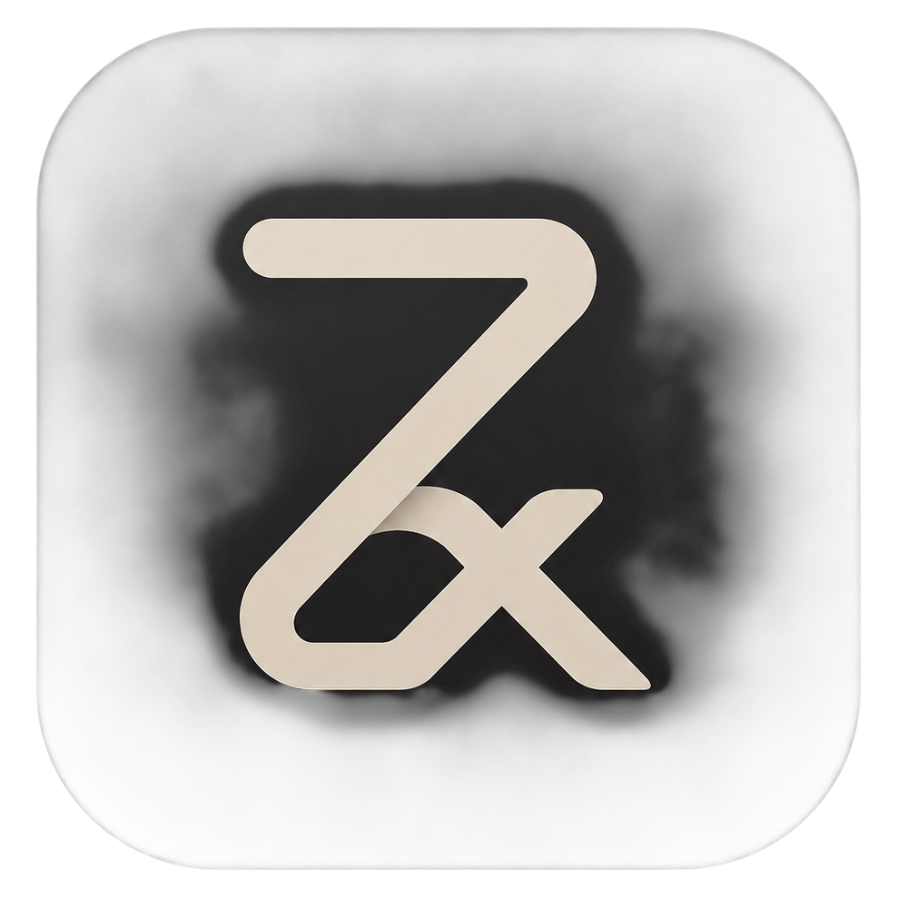
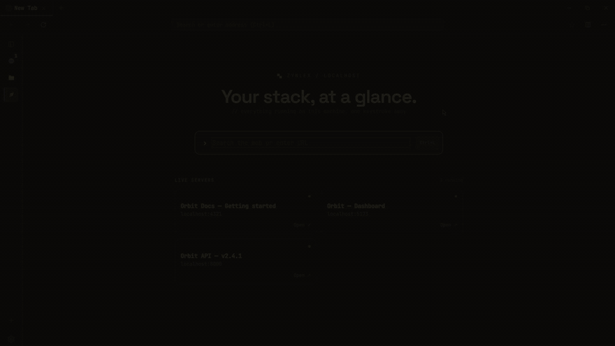
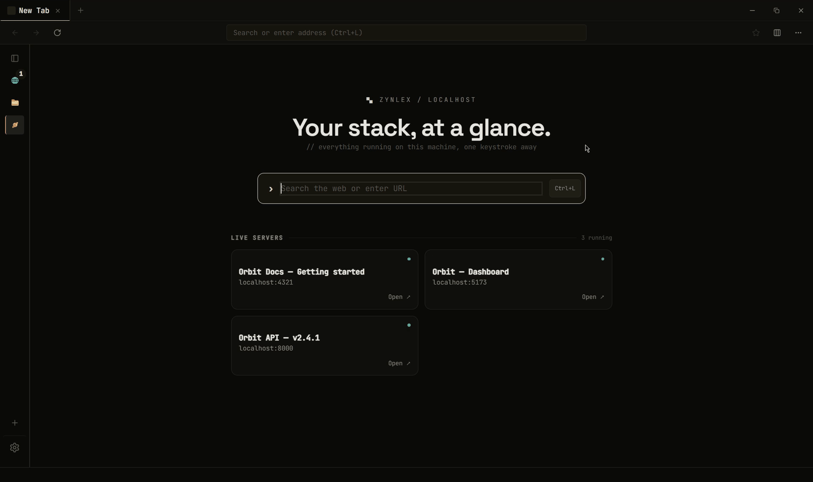
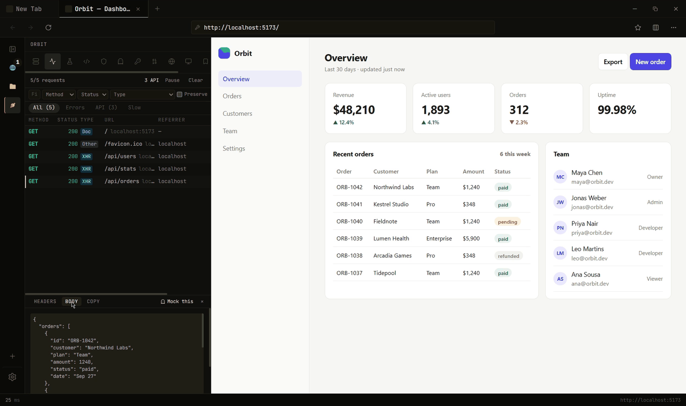
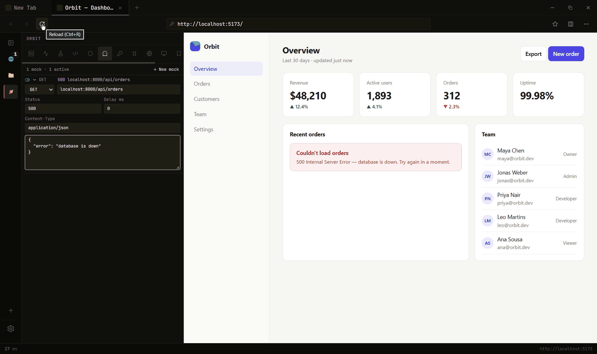
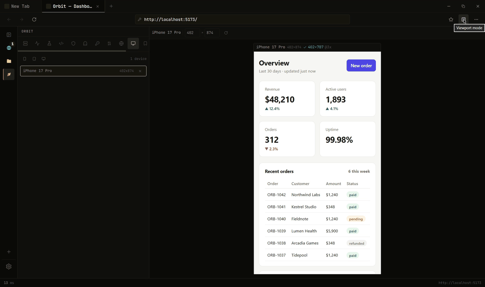
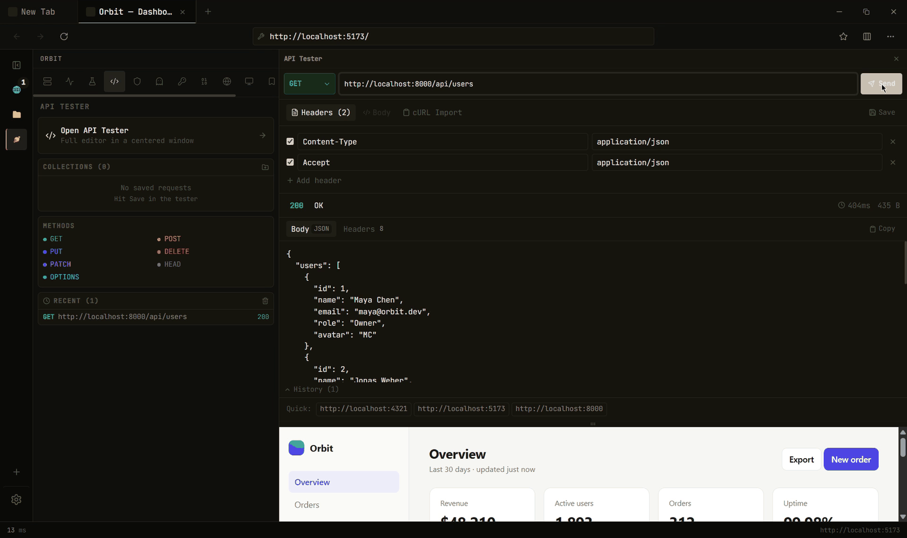

<div align="center">



# ZYNLEX

**The minimal browser for web developers. 3.6 MB, built in Rust and Tauri, not Electron.**

ZYNLEX is a lightweight browser for local web development on Windows: the browser for `localhost`. It finds the dev servers running on your machine, and puts a network log, API response mocking, device viewports, request header rules and an API client in the sidebar. Those are the things you'd otherwise open DevTools, Postman, Charles and a responsive tester for.

[](LICENSE)
[](https://github.com/webtools-dotcom/Zynlex/actions/workflows/ci.yml)
[](https://github.com/webtools-dotcom/Zynlex/releases/latest)
[](https://github.com/webtools-dotcom/Zynlex/releases/latest)

<a href="https://webtools-dotcom.github.io/Zynlex/assets/zynlex-tour.mp4"></a>

<sub>[Watch the full tour in 1080p](https://webtools-dotcom.github.io/Zynlex/assets/zynlex-tour.mp4) · [Website](https://webtools-dotcom.github.io/Zynlex/)</sub>

### [Download for Windows →](https://github.com/webtools-dotcom/Zynlex/releases/latest)

3.6 MB installer · about a third less RAM than Chrome · no account, no telemetry · free and open source

</div>

---

## What it does

New tab shows your running dev servers. ZYNLEX scans localhost, reads the page titles, and lists them. Click one to open it.

The sidebar has the things you'd otherwise keep four apps around for:

- **Network log**: per-tab capture with filters, URL search, pause, and response bodies
- **Mock responses**: fake any API response (status, body, delay) by URL pattern, or click "Mock this" on a captured request and edit it. No proxy, no certificate
- **Device viewports**: one device at a time, rendered at its real pixel size
- **Header rules**: add, override or strip request headers, matched per URL pattern
- **API client**: saved collections, cURL import, runs through Rust so page CORS doesn't apply
- **Inspector**: meta tags, Open Graph previews, and cookies including HttpOnly
- JWT decoder, Base64, user-agent switcher

Workspaces keep each project's tabs, bookmarks, header rules and saved requests apart. `Ctrl+K` finds all of it.

No account. No telemetry. The only network call it makes on its own is an update check against this repo's GitHub releases.

## Who it's for

Frontend and full-stack developers who spend the day on `localhost`. ZYNLEX is meant to be the browser you keep open next to your editor while you build: open your app, watch its requests, fake the API responses you can't easily reproduce (a 500, an empty list, a slow endpoint), check it on a phone-sized viewport, and move on.

It's a normal browser too — you can browse in it — but it isn't trying to replace Chrome or Firefox as your everyday browser.

## How it compares

| If you use… | For… | ZYNLEX |
|---|---|---|
| Chrome DevTools | Network tab, device mode | Same data, kept in the sidebar per tab, alongside the tools below |
| Charles / Proxyman / Requestly | Mocking and rewriting responses | Built in, no proxy or root certificate. Covers the page's own requests, not other apps |
| Postman / Insomnia | Sending API requests | A lighter API client with collections and cURL import, saved per workspace |
| Polypane / Responsively | Multi-device testing | One device at a time at real size. Use those if you need many side by side or accessibility audits |

## Why it exists

Two months ago I was watching [a video by @crynta](https://youtu.be/kykgXa7sm1g) and got stuck on a comment thread underneath it, where people were asking for a lightweight, telemetry-free browser. I wanted one too. But the version I actually needed was for development work, so that's the one I built.

Chrome DevTools is good and lives in the wrong place. It is a drawer inside a browser that has no idea what you're working on. Responsively and Polypane lead with device frames and aren't browsers you'd actually browse in. So the four things I check constantly (which port is that, what did that request return, how does this look on a phone, what happens with this header) lived in four separate windows.

ZYNLEX puts them in the browser chrome instead.

## Size and memory

Measured on one Windows 11 machine, clean profiles, identical pages, same window size:

| | ZYNLEX | Chrome |
|---|---|---|
| Idle, one blank tab | **452 MB** | 689 MB |
| Three tabs (GitHub, YouTube, localhost) | **~1.1 GB** | ~1.8 GB |

About a third less, and it holds at idle and under load. The idle gap is roughly **237 MB**.

That is not clever engineering, and it's worth being clear about why. Your tabs run on WebView2, which is Chromium, the same renderer Chrome uses. Heavy pages cost the same in both. The savings come from what ZYNLEX doesn't run: no sync, no Safe Browsing, no prerendering, no extension host, no update service. The app process itself is 27 MB.

The installer is 3.6 MB for the same reason. WebView2 already ships with Windows, so there's no bundled copy of Chromium to download. It's also why there's no macOS or Linux build yet.

If you need macOS, several viewports side by side, or accessibility audits, [Responsively](https://responsively.app) and [Polypane](https://polypane.app) do those and ZYNLEX doesn't.

## Install

Download the installer from the [latest release](https://github.com/webtools-dotcom/Zynlex/releases/latest) and run it.

Windows 10 or 11. You need the WebView2 runtime, which is already on Windows 11 and most Windows 10 machines; the installer adds it if it's missing.

From source:

```bash
pnpm install
pnpm tauri dev
```

## A look around

Your servers, on the new tab page:



Network log. Capture goes through WebView2's native COM API, not a proxy, so there's nothing to configure and no certificate to trust.



Mock responses. Click "Mock this" on a request, make it a 500, and see how the page handles it:



A device viewport at 1:1, next to the chrome:



API client, saved per workspace:



## Limitations

Worth knowing before you download:

- **Windows only.** Tabs, cookies, network capture, header injection and viewport emulation are written against WebView2 COM APIs. There's no WebKit equivalent yet, so there is no macOS or Linux build. macOS and Linux are planned, see [ROADMAP.md](ROADMAP.md).
- Downloads show started and finished, not a percentage. Tauri's download event has no progress callback.
- Header rules don't apply to WebSocket handshakes. WebView2 never raises its request event for them.
- The network log records every request type, but only keeps response bodies for text resources. Images, fonts and media show status, size and timing only. Use the type filter or the API chip to cut the asset noise.
- JWT signatures are decoded, never verified.

## FAQ

**Is ZYNLEX a minimal browser I can use every day?**
You can browse in it like any browser, and it is minimal: no sync, no extensions, no account. But it's built around development work, so it isn't trying to be your only browser. Most people keep it open next to their editor.

**Will websites work in it?**
Yes. Tabs render with WebView2, which is Microsoft's packaging of Chromium, the same engine as Chrome and Edge. Pages look and behave the same.

**How is it different from Chrome DevTools?**
DevTools is a drawer inside a general browser. ZYNLEX puts the network log, device viewports and header rules in the browser's own sidebar, per tab and per project workspace, and adds things DevTools doesn't have: localhost server detection, response mocking without a proxy, and an API client.

**Do I need a proxy or a certificate to mock API responses?**
No. Mocks are answered inside the browser, before the request reaches the network, so there's nothing to install or trust. Cross-origin requests work too. The trade-off: it only mocks requests made by pages open in ZYNLEX, not other apps on your machine.

**Why is it so small? Is it Electron?**
It's not Electron. It's built with Tauri and Rust, and uses the WebView2 runtime that already ships with Windows instead of bundling its own copy of Chromium. That's why the installer is 3.6 MB.

**Does it work on macOS or Linux?**
Not yet. Every developer feature is built on WebView2 APIs that only exist on Windows. See [ROADMAP.md](ROADMAP.md).

**Is it free? Does it collect any data?**
Free and open source under Apache-2.0. No account, no telemetry, and it makes no network calls of its own apart from checking GitHub for updates.

## Docs

- [docs/architecture.md](docs/architecture.md): process model, bounds and resize, viewport emulation, security boundary
- [docs/design-system.md](docs/design-system.md): tokens, typography, layout rules
- [CONTRIBUTING.md](CONTRIBUTING.md): build commands and the checks CI runs
- [ROADMAP.md](ROADMAP.md): what's open

## Contributing

If ZYNLEX saves you a window or two, a star helps other developers find it.

Issues and pull requests welcome. If you're picking up something non-trivial, open an issue first so we don't both write it.

Built with [Tauri](https://tauri.app), React and Rust.

## License

[Apache-2.0](LICENSE)
